# hello_world

Nama    : Naily Ikmalul Insiyah

## Praktikum 2

Berikut adalah hasil screenshoot dari praktikum 2:

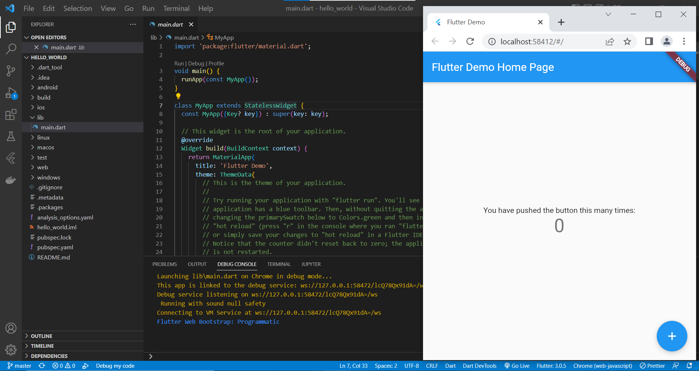

## Praktikum 3
### Langkah 1 Text Widget

Berikut adalah hasil screenshoot dari praktikum 3 bagian text widget:

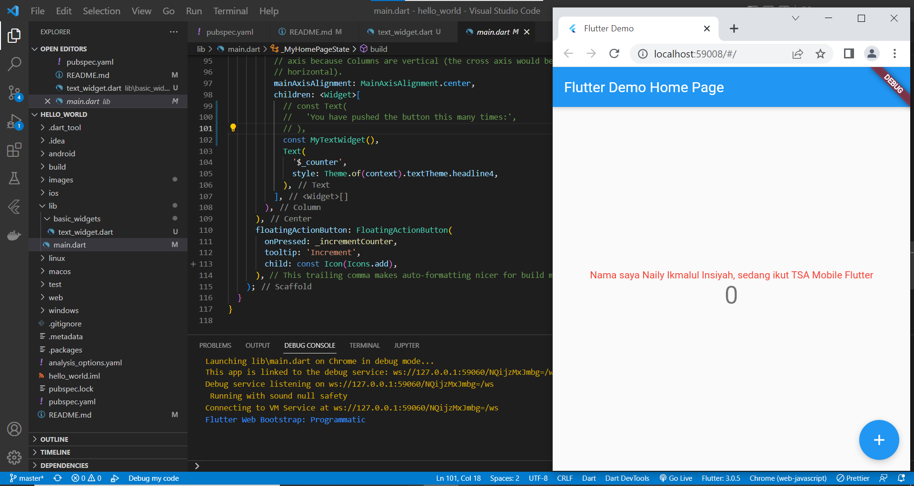

### Langkah 1 Image Widget

Berikut adalah hasil screenshoot dari praktikum 3 bagian image widget:

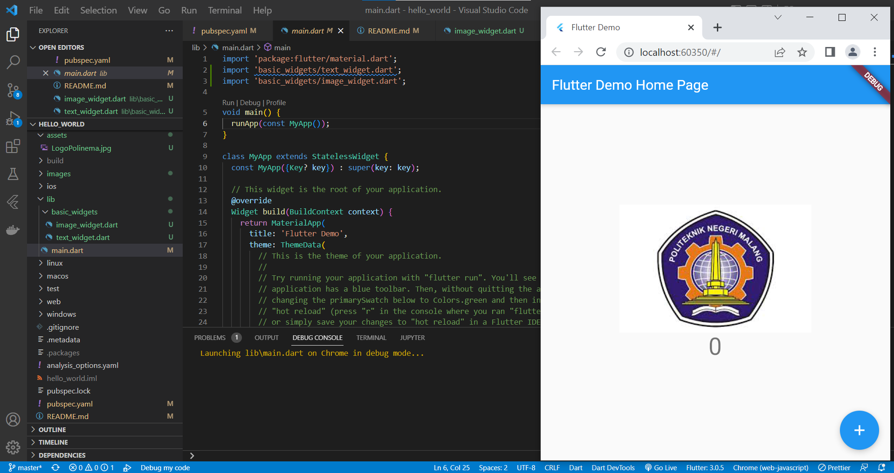

## Praktikum 4
### Langkah 1: Cupertino Button dan Loading Bar

Berikut adalah hasil screenshoot dari praktikum 4 bagian Cupertino Button dan Loading Bar:

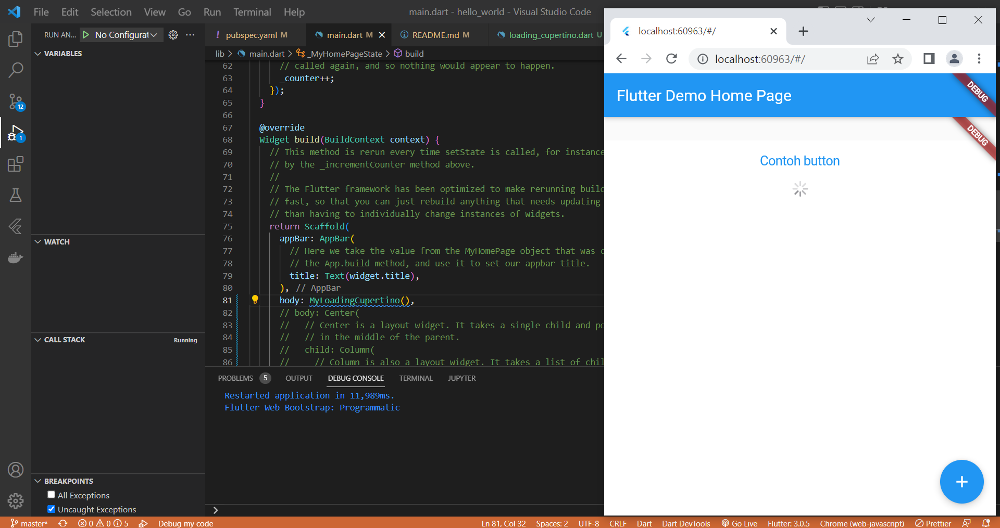

### Langkah 2: Floating Action Button (FAB)

Berikut adalah hasil screenshoot dari praktikum 4 bagian Floating Action Button (FAB):

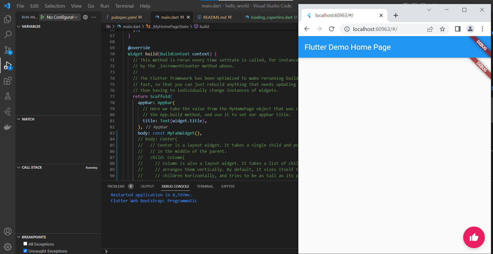

### Langkah 3: Scaffold Widget

Berikut adalah hasil screenshoot dari praktikum 4 bagian Scaffold Widget:

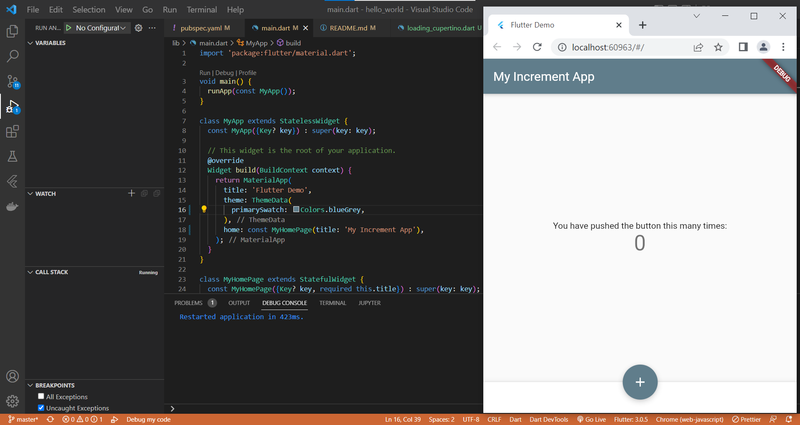

### Langkah 4: Dialog Widget

Berikut adalah hasil screenshoot dari praktikum 4 bagian Dialog Widget:

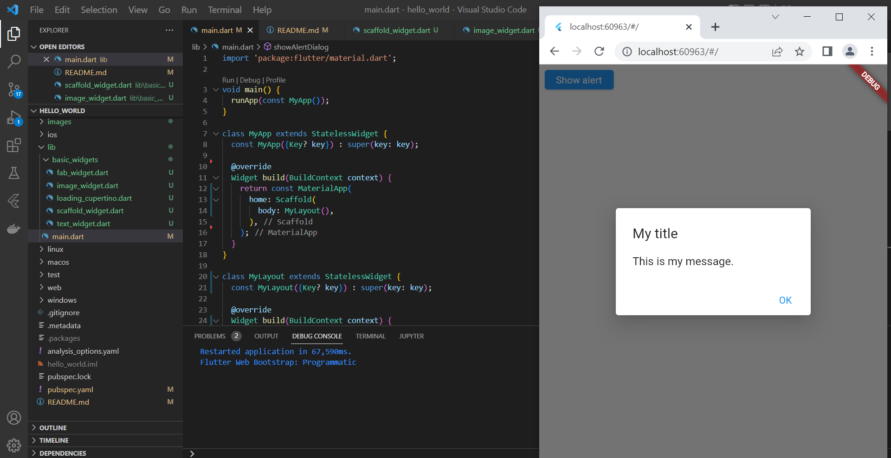

### Langkah 5: Input dan Selection Widget

Berikut adalah hasil screenshoot dari praktikum 4 bagian Input dan Selection Widget:

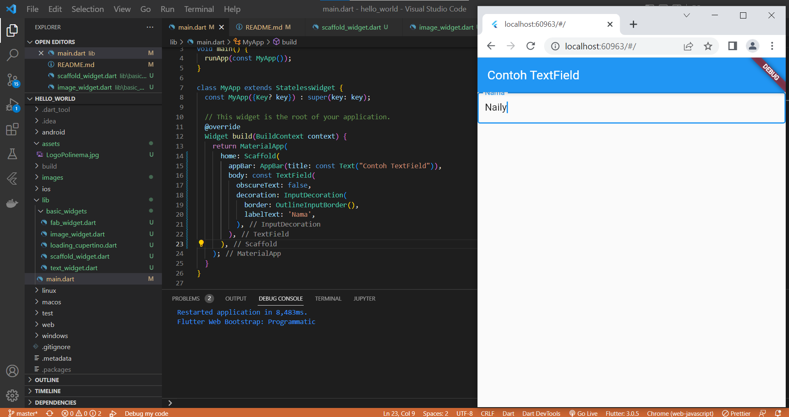

### Langkah 6: Date and Time Pickers

Berikut adalah hasil screenshoot dari praktikum 4 bagian Date and Time Pickers:

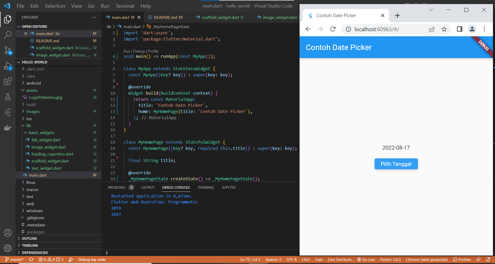

## TUGAS

Pada praktikum 4 mulai dari Langkah 3 sampai 6, buatlah file widget tersendiri di folder basic_widgets, kemudian pada file main.dart cukup melakukan import widget sesuai masing-masing langkah tersebut!

### Tugas 1: Scaffold Widget

Berikut adalah hasil screenshoot pembuatan file widget dari praktikum 4 bagian Scaffold Widget:

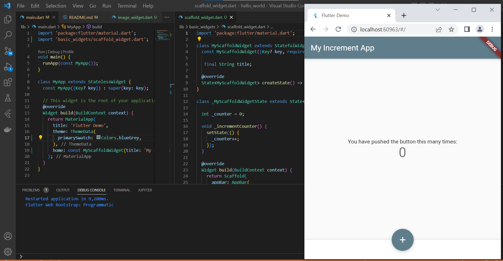

### Tugas 2: Dialog Widget

Berikut adalah hasil screenshoot pembuatan file widget dari praktikum 4 bagian Dialog Widget:

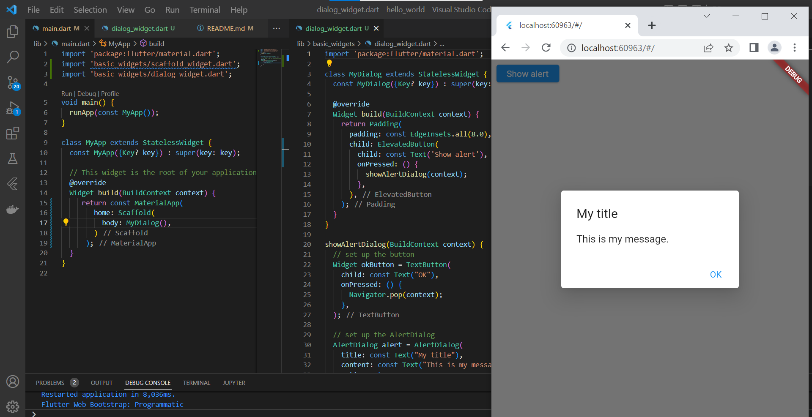

### Tugas 3: Input dan Selection Widget

Berikut adalah hasil screenshoot pembuatan file widget dari praktikum 4 bagian Input dan Selection Widget:

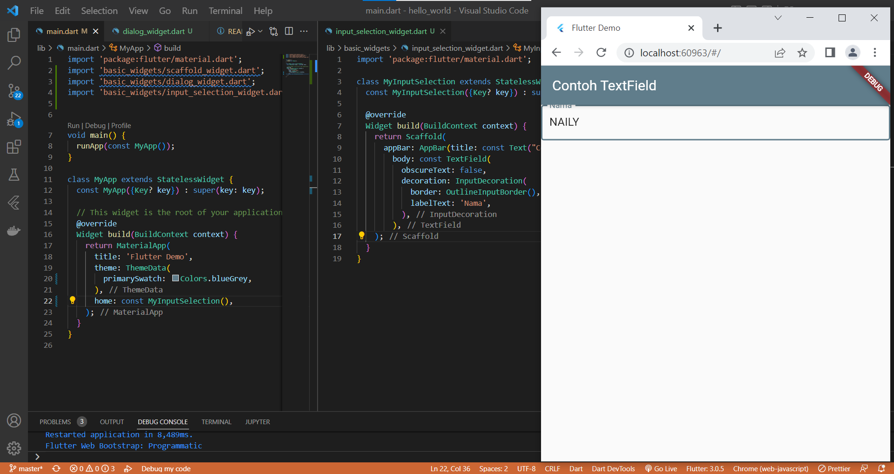

### Tugas 4: Date and Time Pickers

Berikut adalah hasil screenshoot pembuatan file widget dari praktikum 4 bagian Date and Time Pickers:

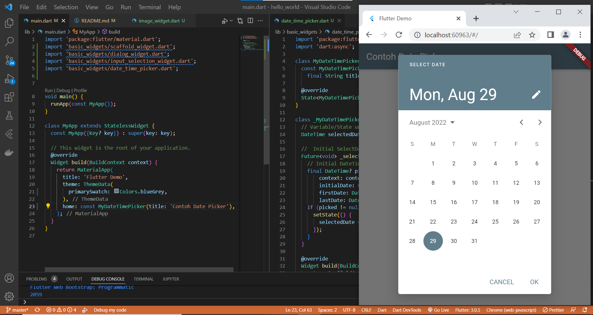
